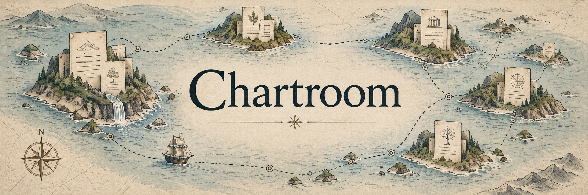
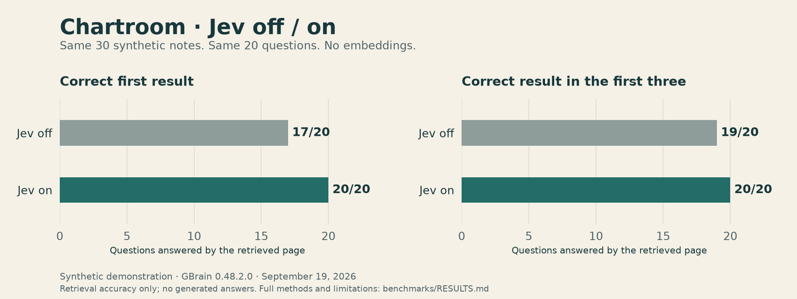

# Chartroom



A local second brain built on [GBrain](https://github.com/garrytan/gbrain), with [TypeSafe Jev](https://typesafe.ai) for better search ranking and useful page connections. MIT licensed.

Save a note. Find the right source. Follow connections to related pages. Chartroom uses Jev to judge relevance, then records connection changes and their history so you can inspect what happened.

Your documents and receipts stay in your local data directory. Configured model providers receive the text needed for their calls. Bring your own API keys.

## A small comparison

Same 30 synthetic notes, same 20 questions, same GBrain version. Jev off versus Jev on:



| Measure | Jev off | Jev on |
| --- | ---: | ---: |
| Correct first search result | 17/20 | **20/20** |
| Correct result in the first three | 19/20 | **20/20** |
| Automatically added connections | 0 | **24** |
| First-pass median search time | 34 ms | 150 ms |

23 of the 24 connections met the preset relevance rules, including 13 navigation links. Jev found 10 of 18 expected relationships; two enrichment calls failed validation, while their documents were still saved. The accounted Jev estimate was **$0.00446**, excluding unknown usage from rejected responses. Cached searches took about 31–35 ms.

This is a small synthetic demonstration, not a general accuracy claim. [Read the results and limitations](benchmarks/RESULTS.md) or [reproduce the comparison](benchmarks/compare.py).

## How it works


*Concept illustration; Chartroom currently runs through MCP and the command line.*

1. **Capture:** save a document in GBrain.
2. **Judge:** Jev scores retrieved passages and candidate page connections.
3. **Connect:** Chartroom checks page revisions, publishes selected links and records receipts.
4. **Inspect:** read the history or resume queued graph work without repeating the model judgment.

## Quickstart

Requires Bun 1.4 or later on Linux. Other platforms have not been tested. Download or clone this repository, then run:

```sh
bun install --frozen-lockfile --ignore-scripts
cp .env.example .env
```

Set `TYPESAFE_API_KEY` in `.env` to your TypeSafe key. Optionally set `OPENAI_API_KEY` for embeddings. Without an embedding key, search uses keywords; Jev can still rerank candidates and connect pages. Provider usage is charged to your own account.

Start the owner in one terminal:

```sh
bun run start
```

Initial schema creation may take a little time. Wait for the HTTP listening message. The local endpoint is `http://127.0.0.1:3141/mcp`. The generated bearer token is stored in `.chartroom/client.token`, never printed. Configure your MCP client with that endpoint and token if you want to use Chartroom from an agent.

In a second terminal, from the same directory:

```sh
bun run client status
bun run client capture notes/harbor-sensors examples/sensors.md
bun run client capture notes/garden examples/garden.md
bun run client capture notes/harbor-maintenance examples/maintenance.md
bun run client search "Harbor sensor calibration"
bun run client links notes/harbor-maintenance
bun run client history notes/harbor-maintenance
bun run client work
bun run client resume
```

Connection creation is a model judgment, not a promise that every capture produces a link. The capture response reports `applied`, `abstained` or a failure. `work` shows source-scoped work; `resume` retries at most 20 persisted capture batches without asking Jev to judge them again. Inspect held failures before changing their evidence.

Stop with Ctrl+C. Start the same directory again to retain documents, the token, history and queued graph work. Do not run another owner against the same database. The upstream engine enforces an ownership lock.

## Configuration

| Variable | Default | Purpose |
| --- | --- | --- |
| `CHARTROOM_HOME` | `.chartroom` | Private database, bearer token and usage file |
| `CHARTROOM_PORT` | `3141` | Loopback HTTP port |
| `CHARTROOM_JEV` | `on` | Set `off` for baseline operation without new Jev judgments |
| `TYPESAFE_API_KEY` | unset | Jev API key |
| `TYPESAFE_ENV` | unset | Optional explicitly selected private Jev env file |
| `OPENAI_API_KEY` | unset | Optional OpenAI text embeddings |

The owner binds to loopback only. This preview is for local use; it does not configure remote hosting. Do not point `CHARTROOM_HOME` at an existing live GBrain installation. No personal credential directories are searched. Keep `.env` and the data directory private.

Jev is pinned to `jev-1.13.0`; GBrain is pinned to v0.48.2.0, commit `5cfb84f1d3a809c70064c292c23db3d538d5c551`. Internal upstream hooks are coupled to this revision. Do not change the core version without retesting.

## What is included

- Jev relevance ranking over retrieved candidates, with bounded timeouts and baseline fallback
- capture-to-connection judgments with literal source evidence and source/target revisions
- conditional owner graph batches, idempotent receipts and provenance-preserving undo
- persistent, source-scoped operation history
- explicit, bounded graph-work resume; no unattended scheduler is installed
- local usage accounting in `jev-usage.json`; reported provider input-token cost is an estimate, not a provider invoice or spending cap

Use `bun run client call <tool> '<json>'` for other upstream MCP tools. Whole-page writes replace content; read the current page before editing.

## Limits

This is a working preview, not a finished autonomous maintenance system. General fact/entity/contradiction enrichment, automatic prose editing, the private editorial controller and the personal Android viewer are not included. Captured role classification is an annotation, not an automatic type migration. Semantic links can be wrong; inspect their evidence and history.

Jev being unavailable does not undo a saved capture. The response exposes the enrichment failure; search retains its baseline results. Existing approved capture graph packets can be resumed with Jev disabled. A small synthetic Jev off/on comparison is available in [benchmarks/RESULTS.md](benchmarks/RESULTS.md); it is not a general benchmark.

The integration's native usage record does not include embedding or other provider costs. Model keys and document content are not included in public examples or test fixtures.

## Tests

```sh
bun test tests
```

The tests use synthetic data and disposable directories. Real-provider smoke testing is separate and requires your own credentials. See [VERIFICATION.md](VERIFICATION.md) for what was actually checked.

## License and credit

MIT. GBrain is copyright 2026 Garry Tan; its notice is retained in [LICENSE](LICENSE). See [THIRD_PARTY_NOTICES.md](THIRD_PARTY_NOTICES.md). Chartroom is independent of GBrain and TypeSafe. Hosted provider services and model weights are not covered by this repository's code license.
